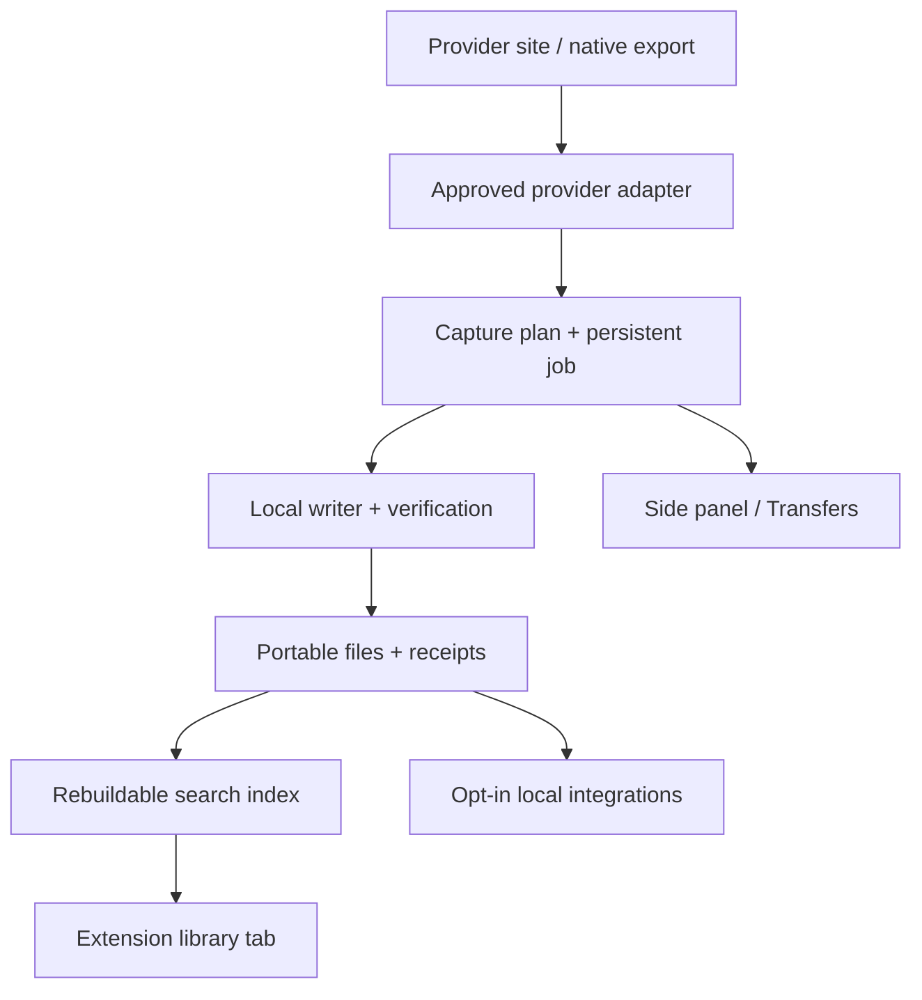

# Kura — engineering and delivery contract

Status: proposed, 2026-09-17. Read [PRD](PRD.md), [UX](UI-UX.md) and
[provider policy](OPEN-SOURCE-AND-PROVIDERS.md) together. No runtime changes in this PR.

## 1. Existing work and integration order

Repository: `frankxai/kura`. Audit baseline is main
`e6034b055c56659ecac9b988c2e9c162d11945f4`. Branch heads inspected:

| Branch / head | Reusable work | Integration obligation |
| --- | --- | --- |
| `agent/codex/image-library-pilot` / `d7412970178badb71ccc0f6211d29d3ea33a7fdd` (PR #6) | Local image importer, gallery, checksums, receipts/checkpoints, fixture tests, later async-selection/metadata-conflict fixes | Preserve storage contracts; real Midjourney/Grok sample acceptance still missing; hosted build is older than branch |
| `agent/claude/kura-godmode` / `3ae126a93a0ec7a9c35ca229f7017eef681558ff` | Capture plans, folder writer, offscreen proposal, Gemini changes and UI work | Review writer lifetime/permissions, strict result semantics, unrelated WIP and changed selectors |
| `agent/claude/untrack-asph-wip` / `1e2f5c504eb94776d3d75b0754c311eb6d85d373` | Cleanup branch for that work | Compare against godmode; do not reintroduce tracked scratch patches |
| `agent/codex/suno-official-intake` / `914523ec1935e174d14436361f2e40944b97688c` (PR #4) | Official-download local intake and tests | Bring into extension UX; do not assume it replaces/clears the existing public-profile harvester |
| `agent/c940/kura-sis-bridge` / `6a5240f6e7db7039d4ead253d4bf880615b66bd6` (PR #3) | Pointer-based SIS intake, privacy/store documentation and tests | Preserve opt-in boundaries and existing schemas; reconcile overlapping background/CI changes |

Refresh heads before editing or merging. Review commits by concern rather than
merging every branch wholesale. Keep draft implementation PRs and this product
specification independent. Current main's stale repo identity is already addressed
in the pilot branch; do not create another competing rename patch.

Concrete gaps on audited main: in-memory download queue, success reported before
download completion, overwrite conflict behavior, object-URL creation in the MV3
worker, broad legacy provider unions, formats declared beyond verified writers,
and separate music/image persistence models. A symbol in a TypeScript union is not
evidence of a working exporter. The README support checkmarks require revalidation.

## 2. Architecture decision

Keep TypeScript and WXT. Preserve the present framework choice while extracting
small shared UI/state modules; a React/shadcn rewrite is not a prerequisite for
quality. Use the same domain engine for every media type. Browser-specific code
lives behind narrow transport/storage interfaces.



The content script observes only the supported, permitted surface. It does not
own filesystem writes or trust messages from the page as commands. Validate
message schema, size, sender, tab origin, job identity and account context. Avoid
provider page CSS leakage by keeping controls in extension-owned surfaces.

The service worker orchestrates durable, bounded work and reschedules eligible
tasks; it is not a permanent daemon. Persist state before acknowledging work.
Chrome documents worker termination and loss of global variables, so no critical
queue is memory-only. [Chrome worker lifecycle](https://developer.chrome.com/docs/extensions/develop/concepts/service-workers/lifecycle).

First storage execution target: a visible extension library page owns the folder
handle/writer. Closing it checkpoints and pauses when necessary. The offscreen
branch is reusable only after a browser spike verifies its documented purpose,
API limits and lifecycle; do not invent a general-purpose offscreen daemon or
assume it supports arbitrary extension APIs. [Offscreen API](https://developer.chrome.com/docs/extensions/reference/api/offscreen).

Native Downloads is a fallback backend with explicit limits: accepted download ID
is not completed transfer, and completed transfer is not read-back-verified archive
ingestion. Watch completion/failure, then acquire file access when needed to verify
and index. Never label unverified Downloads output as a verified library item.

## 3. Adapter contract

Each adapter publishes a versioned capability manifest, not a boolean `supported`:

| Field | Required meaning |
| --- | --- |
| `provider`, `adapterVersion` | Stable identifiers, recorded in every observation/receipt |
| `surfaces`, `accountKinds` | Actual tested pages/workspaces; no inferred consumer/API equivalence |
| `contentKinds`, `formats` | Exported content and source formats, separately from presentation derivatives |
| `routes` | Approved direct integration, native-export handoff, local-file import; unapproved routes disabled |
| `scope` | Selection, visible branch, export, public catalog or account library |
| `permissionReview` | Policy evidence, applicable region/account, reviewed-on, owner, due date, decision |
| `technicalEvidence` | Build SHA, fixtures, live sample receipt, supported browser versions, last verified date |
| `originalAvailability` | Original, preview-only, conditional or unknown; evidence per item overrides defaults |
| `metadataFields` | Field-level availability and provenance |
| `pagination` | Cursor/export-end evidence and explicit unknown-total support |
| `limits` | Request/byte/item limits, concurrency, retry ceiling, entitlement constraints |
| `availability` | Experimental, verified, degraded, unavailable; reason and approved fallback |

Interface sketch (a design contract, not an implemented SDK):

```ts
interface CaptureAdapter {
  capabilities(context: AccountContext): CapabilityManifest;
  discover(request: ScopedRequest, cursor?: OpaqueCursor): Promise<DiscoveryPage>;
  normalize(candidate: SourceCandidate): Promise<SourceObservation>;
  plan(selected: SourceObservation[]): Promise<CapturePlan>;
  acquire(asset: ApprovedAsset, signal: AbortSignal): Promise<ByteSource>;
  refreshExpired(asset: ApprovedAsset): Promise<ApprovedAsset | NeedsUserAction>;
}
```

Local imports use File/stream sources; handoff adapters return instructions and
await user selection rather than calling unsupported acquisition methods. An
adapter does not write canonical files, modify global settings, execute remote
code or bypass the shared queue's caps. Reject arbitrary fetch URLs; validate
allowed origins and redirects and keep signed URLs out of diagnostics.

Package extraction/parser code in the extension release. No remote executable
adapter updates, eval, injected downloaded scripts or dynamic WASM from a server.
Runtime schema validation applies even to typed internal messages. Use WXT's
documented lifecycle/cleanup for SPA navigation and content-script invalidation.
[WXT content scripts](https://wxt.dev/guide/essentials/content-scripts.html).

## 4. Domain and storage

New additive domain records:

- **Creation:** stable local ID and content kind, with provider/account-scoped identity.
- **Source observation:** observed metadata, route, capture time, provider version,
  source location and field provenance. Multiple observations may share bytes.
- **Asset:** MIME, byte count, hash, quality classification and relative original path.
- **Relations:** contains, generated-from, attachment-of, version-of, cover-of, stem-of.
- **User curation:** notes, tags, favorites and collections, preserved independently.
- **Job/receipt:** selected scope, per-item outcomes, bytes, timestamps and limitations.

Do not silently convert FORMAT_SPEC v0.2.0 or move existing image/Suno paths into
a new universal folder structure. Add mapping/index records first. A future migration
needs schema versioning, reader compatibility, backup, dry run and rollback proof.
The raw filesystem remains authoritative; the search index is rebuildable. A
checkpoint is durable local job state, not proof that a file exists or is valid.

Use stable provider identity plus content hash: same asset across prompts keeps
distinct observations; modified content yields a new version; renamed downloads
do not become duplicates. Identical content with new metadata is a review/reconcile
operation, not an excuse to silently drop metadata or overwrite earlier evidence.

Write original to a job-owned staging location, close, read back and verify, then
commit receipt/state. File System Access does not provide a universal transaction
across files: design a journal/recovery protocol rather than promising atomic rename.
On restart reconcile staging, originals and receipts. Never overwrite an existing
different original. Cleanup touches only identified job-owned partial files after
recovery or explicit user action. Do not traverse outside the selected root.

Large media must be streamed with bounded buffers and incremental hashing; do not
load an entire audio/video collection into JS memory. The current image path's
32 MB/file and 200 MB/batch limits remain until streaming/codec tests justify a
new per-kind limit. ZIP intake must bound file count, uncompressed bytes, entry size,
nesting and compression ratio and reject traversal/symlinks/encrypted-unsupported
entries. Validation errors remain visible and never partially masquerade as success.

## 5. Jobs and recovery

Job states: planned → queued → running → verifying → completed, with paused,
needs-user-action, partial, failed and canceled alternatives. Per-item state is
separate from job state. Persist attempts and terminal outcomes; do not reset retry
budgets by closing/reopening the panel. Account changes invalidate pending credentials
and resolutions, not completed archive records.

Start with concurrency 1 per provider, global 2 only after measured tests. Retry
bounded transient failures with exponential backoff/jitter and Retry-After handling.
Do not retry authentication/policy/entitlement errors in a loop. Expired links are
refreshed through the approved adapter route using stable source identity; refreshed
content still requires verification. Never switch to unapproved endpoints to recover.

Use persisted leases plus single-writer ownership across tabs. Recover stale leases
after worker termination with a tested protocol; do not assume Web Locks survive
browser restart. Pause checkpoints at file boundaries; byte-range resume is only
advertised when the provider/backend supports and has verified it. Otherwise restart
the pending file and preserve completed files.

Unknown bytes are explicit. Estimate known originals plus thumbnails/receipts/index
and staging overhead; don't treat browser-origin quota as free destination-drive
space. Require explicit drive admission before the first larger batch; handle
disk-full as a resumable failure. No bulk job while real small-sample gates are open.

## 6. Security and operation

Request optional site permissions at the moment the user enables that provider;
keep host/CDN scope bounded and justify each permission in the store package.
Reconcile existing broad manifest grants deliberately; this documentation does not
change them. The user logs in at the provider. No passwords, cookies, auth tokens,
private response dumps or signed download URLs in logs/diagnostic bundles.
[Chrome permissions](https://developer.chrome.com/docs/extensions/develop/concepts/declare-permissions).

Archive contents are untrusted. Prevent script execution, unsafe URL protocols,
HTML/SVG remote loads, path traversal and archive bombs. Sanitize generated previews;
original executable artifacts remain bytes, never privileged extension code. Local
MCP later uses authenticated, scoped capabilities, read-only defaults, explicit
write approval and origin/DNS-rebinding defenses. Page content cannot issue commands
to that bridge. A read-only local index works before any browser-control bridge.

No default content telemetry, LLM processing or remote feature fetching. Keep
diagnostics local; an explicit export previews the redacted fields. Support records
include build/adapter versions, error codes, counts and evidence references, not
private text. Optional future cloud costs must have a separate opt-in budget.

## 7. Delivery packets and ownership

Roles below are required responsibilities, not a claim that people/agents have
been assigned or that independent review occurred. Name owners in each implementation
PR: product/architecture, implementation, security/persistence review, UX review,
release verification. The author cannot self-certify independent review.

| Packet | Bounded change | Dependency | Exit evidence |
| --- | --- | --- | --- |
| E0 | Reconcile branches, capability inventory and provider policy; disable unapproved routes in release configuration | This contract | Exact source manifest and honest support table; no unrelated WIP |
| E1 | Durable job/writer integration and truthful queued/transferred/verified semantics | E0 | Worker/browser fault tests, read-back hashes, preserved user edits |
| E2 | Midjourney/Grok five-item journeys through cleared routes in extension UI | E1 + route review + actual samples | Source comparison, interruption, repeat skip, full receipt; issue #5 pilot gates |
| E3 | Chat/export parser fidelity and Claude artifact/file bundles | E1 + official schemas/samples | Branches/citations/code/file-version corpus, safe previews |
| E4 | Suno official download intake, mixed audio/video library and entitlement-aware handoff | E1 + native samples | Playable originals, metadata/version relations, no unauthorized harvester fallback |
| E5 | Unified collections/search/export at 10k records; store package | E2–E4 | UX/performance/privacy/browser matrix and independent review |
| E6 | Additional providers, larger batches, optional local MCP | E5 + demand + per-route permission | One adapter conformance report per expansion; no core rewrite |

Planning assumption: one experienced implementation owner with separate review,
roughly 1–2 engineering weeks for E0/E1, 1–2 for E2, and 2–4 for E3–E5. These are
unvalidated effort ranges, not deadlines; provider approvals and real account access
are external dependencies. Re-estimate after E1. No honest universal-provider date
exists before acquisition feasibility is established.

Build/test can run in this chat's workspace and GitHub CI. Real signed-in provider
acceptance runs on an authorized desktop browser; local Codex is optional assistance.
Keep private fixtures out of git. Store submission and approval are distinct from
build success and website deployment. The product does not require Codex to run.

## 8. Release gates and evidence

Blocking on the exact extension commit/package: lint, types, build, meaningful unit
and adapter contracts, Chromium extension E2E, storage failure tests, permission and
malformed-input tests, dependency/license audit and store-package inspection. Existing
informational Playwright CI does not satisfy this release gate until made blocking
or replaced with an equivalent reliable gate.

Required fault cases: terminate worker after each write stage; restart browser;
close source/library tab; revoke folder/site permission; change account; expire URL;
429/5xx; partial download; disk full/unplugged; malformed metadata; changed source;
identical bytes/new metadata; hostile artifact; missing original; parallel tabs;
ZIP traversal/bomb; edited user frontmatter; unavailable provider history.

Fixtures prove the engine. Actual source-vs-archive comparison proves a provider
route. Test the supported current/stable-minus-one Chrome/Edge versions on Windows,
current Chrome on macOS, keyboard/screen reader, narrow panel and both themes.
Never substitute a screenshot fixture for an original-resolution download test.

Release receipt records commit, package SHA-256, browser/OS versions, adapter/policy
versions, license notices/SBOM, tests and failures, real-sample status, reviewer,
screenshots, performance measurements, limitations and rollback. Roll out small
pilot cohorts before raising caps. Rollback preserves archives; publish a corrected
extension version and disable only affected acquisition routes while local reading
and export remain available. Do not silently downgrade a storage schema.
